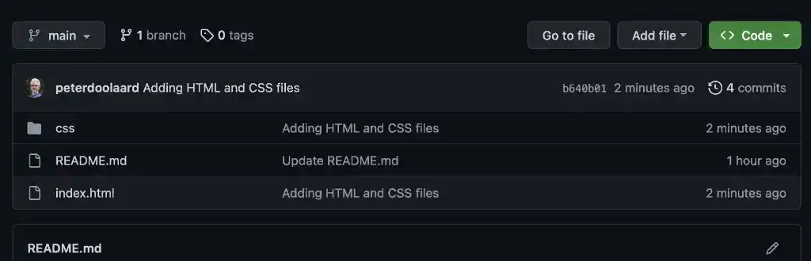
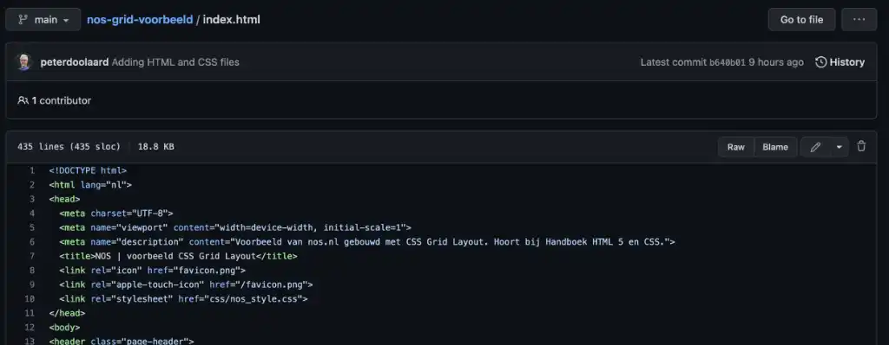
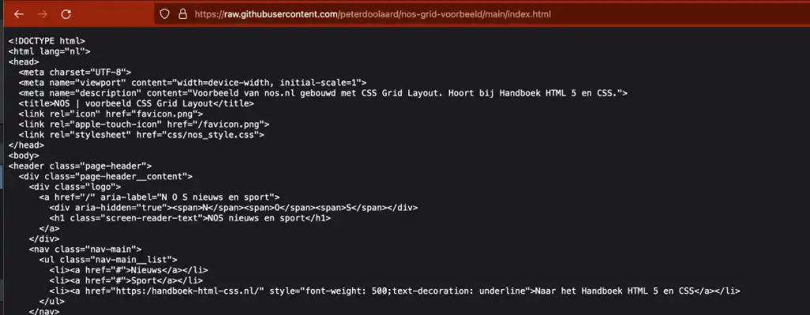

# Website NOS gebouwd met CSS Grid Lay-out

De voorpagina van [nos.nl](https://nos.nl) is voor het [Handboek HTML5 en CSS](https://handboek-html-css.nl) nagebouwd met CSS Grid Layout. De uitleg is te vinden in het Handboek, hier vind je de code.

De code is op twee manieren te gebruiken:

1. Kopieer de code.
2. Kloon de repository.

## Kopieer de code

Dit is de makkelijkste optie als je nog nooit met GitHub hebt gewerkt.

1. Hierboven zie je de bestandenlijst van deze repository (repo). Klik op index.html.

2. Nu zie je de inhoud van dat bestand. Klik rechts direct boven de code op de knop Raw.

3. De kale code wordt geopend in het browservenster. Klik in dit venster, druk op Ctrl+A (Command+A) om alle code te selecteren en druk op Ctrl+C (Command+C) om de selectie te kopiëren.

4. Maak op je eigen computer in je projectmap een nieuw bestand index.html en plak daar de code in.

Herhaal de stappen voor het bestand nos_style.css in de map css.

## De repository klonen
 

